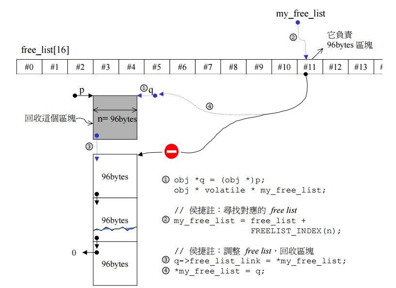

## STL--空间适配器
目录

1. [空间适配器概述](#空间适配器概述)
2. [对象的构造和析构](#对象的构造和析构)
3. [内存的配置和释放](#内存的配置和释放)
4. [配置器的使用](配置器的使用)


<span id = "空间适配器概述"></span>
###空间适配器概述
在STL的实现中，空间适配器是重中之重，因整个STL的操作对象都放在容器之内，而容器一定需要配置空间以置放资料。所以得先看它。

C++ STL的空间配置器将内存的配置，释放和对象的构造和析构分开，内存配置操作由alloc::allocate()负责，内存释放由alloc::deallocate()负责;对象构造操作由::construct()负责，对象的析构操作由::destroy()负责。


<span id = "对象的构造和析构"></span>
###对象的构造和析构


```
//---构造函数---//
// 使用placement new在已经分配的内存上构造对象
template <class _T1, class _T2>
inline void _Construct(_T1* __p, const _T2& __value) {
    new ((void*) __p) _T1(__value);//将value设定到指针p所指的空间上
}

//--析构函数--//
//--第一个版本：接受一个指针--//
template <class _Tp>
inline void _Destroy(_Tp* __pointer) {
  __pointer->~_Tp();
}

//--第二个版本：接受两个迭代器--//
template <class _ForwardIterator>
inline void _Destroy(_ForwardIterator __first, _ForwardIterator __last) {
  __destroy(__first, __last, __VALUE_TYPE(__first));
}

// 特化版本
inline void _Destroy(char*, char*) {}
inline void _Destroy(int*, int*) {}
inline void _Destroy(long*, long*) {}
inline void _Destroy(float*, float*) {}
inline void _Destroy(double*, double*) {}
inline void _Destroy(wchar_t*, wchar_t*) {}

// 析构一组对象, 用于具有non-trivial destructor
template <class _ForwardIterator>
void
__destroy_aux(_ForwardIterator __first, _ForwardIterator __last, __false_type)
{
  for ( ; __first != __last; ++__first)
    destroy(&*__first);
}

// 如果没有类型non-trivial destructor, 则使用此函数
template <class _ForwardIterator> 
inline void __destroy_aux(_ForwardIterator, _ForwardIterator, __true_type) {}

// 使用traits技术, 判断类型是否就有non-trivial destructor, 然后调用不同的函数
template <class _ForwardIterator, class _Tp>
inline void 
__destroy(_ForwardIterator __first, _ForwardIterator __last, _Tp*)
{
  typedef typename __type_traits<_Tp>::has_trivial_destructor
          _Trivial_destructor;
  __destroy_aux(__first, __last, _Trivial_destructor());
}
```

<span id = "内存的配置和释放"></span>
###内存的配置和释放
在内存配置方面，STL分为两级配置器，当请求的内存大于128b的时候调用第一级配置器，当请求的内存小于等于128b的时候调用第二级配置器。先来看看下面这张表，大概就能知道第一级和第二级配置器主要干了些什么，其他的一些细节如内存池是怎么工作的，下面会给出具体解释。


####第一级配置器
先看下第一级配置器的源码

```
template <int __inst> {

private:

    // 调用malloc函数不成功后调用
    static void* _S_oom_malloc(size_t);
    // 调用realloc 函数不成功后调用
    static void* _S_oom_realloc(void*, size_t);
    
    // 类似于C++的set_new_handle错误处理函数一样，如果不设置，在内存不足时，返回THROW_BAD_ALLOC
    #ifndef __STL_STATIC_TEMPLATE_MEMBER_BUG
        static void (* __malloc_alloc_oom_handler)();
    #endif
    
public:

    static void* allocate(size_t __n)
    {
       void* __result = malloc(__n);
       if (0 == __result) __result = _S_oom_malloc(__n);
       return __result;
    }
    // 第一级配置器直接调用free来释放内存
    static void* deallocate (void* __p, size_t /* __n */) 
    {
        free(__p);
    }
    
    // 直接调用realloc来分配内存
    static void* reallocate(void* __p, size_t /*old_size */, size_t __new_sz)
    {
        void* __result = realloc(__p, __new_sz);
        if (0 == __result) __result = _S_oom_realloc(__p, __new_sz);
        return __result;
    }
	// 异常处理函数，即内存分配失败后的处理
  static void (* __set_malloc_handler(void (*__f)()))()
  {
    void (* __old)() = __malloc_alloc_oom_handler;
    __malloc_alloc_oom_handler = __f;
    return(__old);
  }
}

``` 

从上述源码中可以看到，STL的第一级配置器仅仅是调用了malloc，free等函数，然后增加了内存分配错误下的异常处理函数，下面我们就通过源码来看看在内存分配失败后，STL是怎么处理的。

```
// 以下是针对内存分配失败后的处理
// 首先，将__malloc_alloc_oom_handler的默认值设为0
#ifndef __STL_STATIC_TEMPLATE_MEMBER_BUG
template <int __inst>
void (* __malloc_alloc_template<__inst>::__malloc_alloc_oom_handler)() = 0;
#endif

template <int __inst>
void*
__malloc_alloc_template<__inst>::_S_oom_malloc(size_t __n)
{
    void (* __my_malloc_handler)();
    void* __result;
    
    for (;;) { // 不断尝试释放，再配置，再释放，再配置
        __mymalloc_handler = __maloc_alloc_oom_handler;
        if (0 == __my_malloc_handler) {// 这里是当没有设置处理函数的时候，直接抛出异常
            __THROW_BAD_ALLOC;
        }
        (*__my_malloc_handler)();// 调用处理例程，尝试释放内存
*          __result = malloc(__n); // 再重新分配内存
         if (__result) return (__result); // 如果分配成功则返回指针
    }
}

template <int __inst>
void* __malloc_alloc_template<__inst>::_S_oom_realloc(void* __p, size_t __n)
{
    void (* __my_malloc_handler)();
    void* __result;

    for (;;) {
        __my_malloc_handler = __malloc_alloc_oom_handler;
        if (0 == __my_malloc_handler) { __THROW_BAD_ALLOC; }
        (*__my_malloc_handler)();
        __result = realloc(__p, __n);
        if (__result) return(__result);
    }
}

```


####第二级配置器
当申请内存小于128b的时候，会调用第二级配置器。第二级配置器有一个内存池和一个对应的自由链表，其定义如下：

```
  union _Obj {
        union _Obj* _M_free_list_link;
        char _M_client_data[1];    /* The client sees this.        */
  };
```
这里有一个技巧，如果使用union的第一个成员，则指向另一个相同的union obj；而如果使用第二个成员，则指向实际的内存区域，这样一来，既实现了链表结点只用一个指针的大小空间，却能同时做索引和指向内存区域。

这里的这个技巧我觉得有必要解释一下，首先client_data是一个常量指针，指向client_data[0]，然后client_data[0]和free_list_link共用同一段内存，我们在使用这个union的时候，先让client_data指向实际的内存区域，然后将free_list_link(也就是client_data[0])赋值为下一个结点的地址，注意这里我只是修改了client_data[0]，client_data并没有修改，而是始终指向实际内存。

分配过程是这样的，每次分配一大块内存，存到一个free list中， 下次client若再有相同大小的内存要求，就直接从这个free list 中划出，内存释放时，则直接回收到对应的list中。为了管理的方便，实际分配的大小都被调整为8的倍数，所以有16个free lists，分别为8,16,24,32,40,48,56,64,72,80,88,96,104,112,120,128bytes。例如需要20bytes，将会被自动调整为24bytes。

为了节省内存使用，使用 union 结构，这个设计很巧妙，每一个元素（内存区域对象）即可以当作下一个元素的指针，例如后面代码中的 `result -> _M_free_list_link`，也可以当作该元素的值，例如 `*__my_free_list`。整个 free lists 的结构便是一串使用后者的元素构成的节点，每个节点的值是使用前者构成的单向链表的首地址。

```
enum {_ALIGN};   //小型区块的上调边界
enum {_MAX_BYTES = 128}; //小型区块的上线
enum {_NFREELISTS = 16}; //free-lists个数

//第一参数用于多线程
template <bool threads, int inst>
class __default_alloc_template {
private:
    	// 此函数将bytes的边界上调至8的倍数
      _S_round_up(size_t __bytes) 
      {
        return (((__bytes) + (size_t) _ALIGN-1) & ~((size_t) _ALIGN -1));
      }
__PRIVATE:
  union _Obj {
        union _Obj* _M_free_list_link;
        char _M_client_data[1];    /* The client sees this.        */
  };
private:
    // 16个free-lists
    static _Obj* __STL_VOLATILE _S_free_list[_NFREELISTS]; 

// 根据待分配的空间的大小，在free_list中选中合适的大小
	static  size_t FREELIST_INDEX(size_t bytes)  
	{  
	   return (((bytes) + __ALIGN-1)/__ALIGN - 1);  
	}

//返回一个大小为n的对象，并可能加入大小为n的其它区块到free-lists
static void _S_refill(size_t n);

//配置一大块空间，可容纳nobjs个大小为“size”的区块
//如果配置nobjs个区块有所不便，nobjs可能会降低，所以需要引用传递
static char* _S_chunk_alloc(size_t __size, int& __nobjs);

// 内存池
static char* _S_start_free; // 内存池起始点，只在chunk_alloc()中变化
static char* _S_end_free;// 内存池结束点，只在chunk_alloc()中变化
static size_t _S_heap_size;//已经在堆上分配的空间大小

public:
    static void* allocate(size_t n);// 空间配置函数
	static void deallocate(void *p, size_t n); // 空间释放函数
	static void* reallocate(void* p, size_t old_sz , size_t new_sz); //空间重新配置函数

// 一些静态成员变量的初始化
// 内存池起始位置  
template <bool __threads, int __inst>
char* __default_alloc_template<__threads, __inst>::_S_start_free = 0;

// 内存池结束位置  
template <bool __threads, int __inst>
char* __default_alloc_template<__threads, __inst>::_S_end_free = 0;

// 已经在堆上分配的空间大小
template <bool __threads, int __inst>
size_t __default_alloc_template<__threads, __inst>::_S_heap_size = 0;
}

// 内存池容量索引数组  
template <bool __threads, int __inst>
typename __default_alloc_template<__threads, __inst>::_Obj* __STL_VOLATILE
__default_alloc_template<__threads, __inst> ::_S_free_list[
# if defined(__SUNPRO_CC) || defined(__GNUC__) || defined(__HP_aCC)
    _NFREELISTS
# else
    __default_alloc_template<__threads, __inst>::_NFREELISTS
# endif
] = {0, 0, 0, 0, 0, 0, 0, 0, 0, 0, 0, 0, 0, 0, 0, 0, };

```


#####空间配置函数 allocate()


```
  static void* allocate(size_t __n)
  {
    void* __ret = 0;
    
    //大于128就调用第一级配置器
    if (__n > (size_t) _MAX_BYTES) {
        __ret = malloc_alloc::allocate(n);
    }
    else {
        //寻找16个free_list中适当的一个
        _Obj* __STL_VOLATE* __my_free_list
          = _S_free_list + _S_freelist_index(__n);
                // Acquire the lock here with a constructor call.
      // This ensures that it is released in exit or during stack
      // unwinding.
    #ifndef _NOTHREADS
      /*REFERENCED*/
      _Lock __lock_instance;
    #endif
    _Obj* __RESTRICT __result = *__my_free_list;
    if (__result == 0)
    	// 如果没有可用的free list，准备重新填充free_list
        __ret = _S_refill(_S_round_up(__n));
    } else {
        *__my_free_list = __result -> _M_free_list_link;
        __ret = __result;
    }
    return __ret;
   }
```

####重新填充函数refill()

```
/* Returns an object of size __n, and optionally adds to size __n free list.*/
/* We assume that __n is properly aligned.                                */
/* We hold the allocation lock.                                         */
template <bool __threads, int __inst>
void*
__default_alloc_template<__threads, __inst>::_S_refill(size_t __n)
{
    int __nobjs = 20; //默认获取20个
    char* __chunk = _S_chunk_alloc(__n, __nobjs); //找内存池要内存空间
    _Obj* __STL_VOLATILE* __my_free_list;
    _Obj* __result;
    _Obj* __current_obj;
    _Obj* __next_obj;
    int __i;
    // 如果内存池仅仅只够分配一个对象的空间, 直接返回即可
    if (1 == __nobjs) return (__chunk);
    
    // 内存池能分配更多的空间，调整free_list纳入新节点
    __my_free_list = _S_free_list + _S_freelist_index(__n);

    /* Build free list in chunk */
    __result = (_Obj*)__chunk;
    *__my_free_list = __next_obj = (_Obj*)(__chunk + __n);
 //导引free_list指向新配置的空间(取自内存池)
    for (__i = 1; ; __i++) {//从1开始，因为第0个返回给客端
    __current_obj = __next_obj;
    __next_obj = (_Obj*)((char*)__next_obj + __n);
    if (__nobjs - 1 == __i) {
        __current_obj -> _M_free_list_link = 0;
        break;
    } else {
        __current_obj -> _M_free_list_link = __next_obj;
   }
     
  }
  return(__result);
}

```

######内存池函数chunk_alloc()
```
/* We allocate memory in large chunks in order to avoid fragmenting     */
/* the malloc heap too much.                                            */
/* We assume that size is properly aligned.                             */
/* We hold the allocation lock.                                         */
template <bool __threads, int __inst>
__default_alloc_template<__threads, __inst>::_S_chunk_alloc(size_t __size, 
                                                            int& __nobjs)
{
    char* __result;
    size_t __total_bytes = __size * __nobjs;
    size_t __bytes_left = _S_end_free - _S_start_free;// 计算内存池剩余容量  

    //内存池中的剩余空间满足需求 
    if (__bytes_left >= __total_bytes) {
        __result = _S_start_free;
        _S_start_free += __total_bytes;
        return(__result);
    } else if (__bytes_left >= __size) {
        // 如果内存池中剩余的容量不够分配, 但是能至少分配一个节点时,  
    // 返回所能分配的最多的节点, 返回start_free指向的内存块  
    // 并且重新设置内存池起始点  
        __nobjs = (int)(__bytes_left/__size);
        __total_bytes = __size * __nobjs;
        __result = _S_start_free;
        _S_start_free += __total_bytes;
        return(__result);
    } else {
        // 内存池剩余内存连一个节点也不够分配  
        size_t __bytes_to_get = 
	  2 * __total_bytes + _S_round_up(_S_heap_size >> 4);
	       // 将剩余的内存分配给指定的free_list[FREELIST_INDEX(bytes_left)]  

        // Try to make use of the left-over piece.
        if (__bytes_left > 0) {
        //内存池内还有一些零头，先分给适当的free_list
        	//寻找适当的free_list
            _Obj* __STL_VOLATILE* __my_free_list =
                        _S_free_list + _S_freelist_index(__bytes_left);
            // 调整free_list，将内存池中的残余空间编入 
            ((_Obj*)_S_start_free) -> _M_free_list_link = *__my_free_list;
            *__my_free_list = (_Obj*)_S_start_free;
        }
        _S_start_free = (char*)malloc(__bytes_to_get);
        // 分配失败, 搜索原来已经分配的内存块, 看是否有大于等于当前请求的内存块  
        if (0 == _S_start_free) {
            size_t __i;
            _Obj* __STL_VOLATILE* __my_free_list;
	    _Obj* __p;
	       // 试着检查检查free_list中的可用空间，即尚有未用的空间，且区块够大  
            // Try to make do with what we have.  That can't
            // hurt.  We do not try smaller requests, since that tends
            // to result in disaster on multi-process machines.
            for (__i = __size;
                 __i <= (size_t) _MAX_BYTES;
                 __i += (size_t) _ALIGN) {
                __my_free_list = _S_free_list + _S_freelist_index(__i);
                __p = *__my_free_list;
                if (0 != __p) {
                // 找到了一个, 将其加入内存池中  
                    *__my_free_list = __p -> _M_free_list_link;
                    _S_start_free = (char*)__p;
                    _S_end_free = _S_start_free + __i;
                    // 内存池更新完毕, 重新分配需要的内存  
                    return(_S_chunk_alloc(__size, __nobjs));
                    //任何剩余零头将被编入适当的free_list以留备用 
                    // Any leftover piece will eventually make it to the
                    // right free list.
                }
            }
        []()// 再次失败, 直接调用一级配置器分配, 期待异常处理函数能提供帮助  
        // 不过在我看来, 内存分配失败进行其它尝试已经没什么意义了,  
        // 最好直接log, 然后让程序崩溃  
	    _S_end_free = 0;	// In case of exception.
	    /调用第一级配置器，看看out-of-memory机制能不能起点作用
            _S_start_free = (char*)malloc_alloc::allocate(__bytes_to_get);
            // This should either throw an
            // exception or remedy the situation.  Thus we assume it
            // succeeded.
        }
        _S_heap_size += __bytes_to_get;
        _S_end_free = _S_start_free + __bytes_to_get;
        // 内存池更新完毕, 重新分配需要的内存
        return(_S_chunk_alloc(__size, __nobjs));
    }
}                                                         

```

######内存释放函数deallocate()
内存释放函数会将释放的空间交还给free_list以留备用。



其实就是一个简单的单链表插入的过程。

```
  /* __p may not be 0 */
  static void deallocate(void* __p, size_t __n)
  {
    if (__n > (size_t) _MAX_BYTES)
    // 大于128的直接交由第一级配置器释放  
      malloc_alloc::deallocate(__p, __n);
    else {
    // 寻找适当的free_list  
      _Obj* __STL_VOLATILE*  __my_free_list
          = _S_free_list + _S_freelist_index(__n);
      _Obj* __q = (_Obj*)__p;

      // acquire lock
#ifndef _NOTHREADS
      /*REFERENCED*/
      _Lock __lock_instance;
#endif /* _NOTHREADS */
// 调整free_list，回收区块
      __q -> _M_free_list_link = *__my_free_list;
      *__my_free_list = __q;
      // lock is released here
    }
  }
```

<span id = "配置器的使用"></span>
####配置器的使用
通过以上的图和源代码，基本上将STL的两层配置器讲完了，接下来就来熟悉一下怎么使用配置器。

STL将上述配置器封装在类simple_alloc中，提供了四个用于内存操作的借口函数，分别如下：

```
template<class T, class Alloc>
class simple_alloc {
public:
    static T *allocate(size_t n)
                { return 0 == n? 0 : (T*) Alloc::allocate(n * sizeof (T)); }
    static T *allocate(void)	
                { return (T*) Alloc::allocate(sizeof (T)); }
    static void deallocate(T *p, size_t n) 
                { if (0 != n) Alloc::deallocate(p, n * sizeof (T)); }
    static void deallocate(T *p)
                { Alloc::deallocate(p, sizeof (T)); }
};
```

接下来就示范在vector中是怎么使用它的。

```
template <class T, class Alloc = alloc>  //alloc被默认为第二级配置器
class vector {
public:
	typedef T value_type;
  	//...
protected:
	// 专属的空间配置器，每次只分配一个元素的大小
	typedef simple_alloc<value_type, Alloc> data_allocator;
	// 在释放内存的时候直接调用借口函数即可
	void deallocate(){
		if(...){
			data_allocator::deallocate(start , end_of_storage - start);
		}
	}
};
```


####Reference
[STL 源码分析](http://blog.zhengdong.me/2010/11/28/stl-code-digest-creation-3/)
[带你深入理解STL之空间配置器](http://zcheng.ren/2016/08/17/STLAllocater/)

